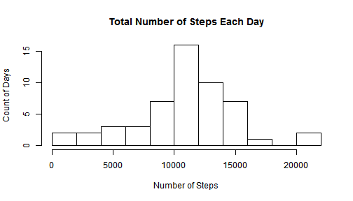
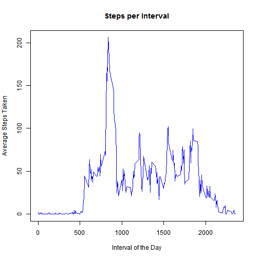
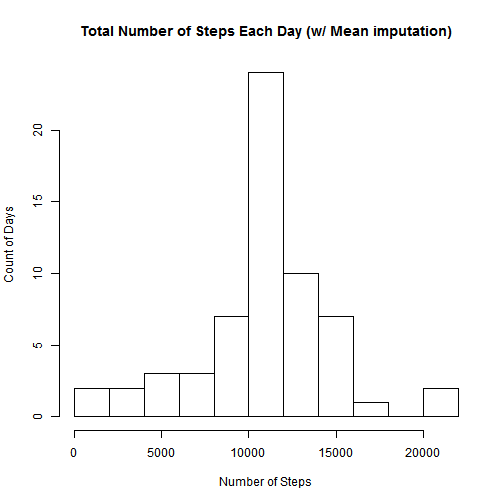
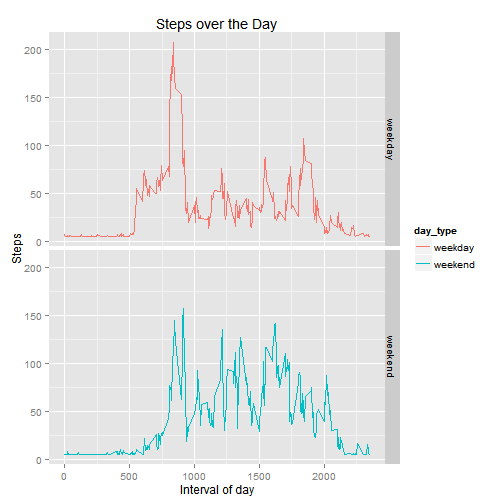

# Project 1: Reproducable Research
---
title: "PA1_template"
author: "Rebecca"
date: "November 11, 2015"
output: html_document
---

## About

The Activity based tracker data for this research is available here: https://d396qusza40orc.cloudfront.net/repdata%2Fdata%2Factivity.zip. This data was stored in the local file called activity.csv.  This was read in with no missing value imputations or format changes.

## Loading and preprocessing the data

```r
activ <- read.csv("activity.csv")
head(activ)
```

```
##   steps       date interval
## 1    NA 2012-10-01        0
## 2    NA 2012-10-01        5
## 3    NA 2012-10-01       10
## 4    NA 2012-10-01       15
## 5    NA 2012-10-01       20
## 6    NA 2012-10-01       25
```

In this data set we have 3 values:
steps: Number of steps taken in a 5-minute interval
date: The date when the measurement was taken
interval: Identifier for the 5-minute interval in which measurement was taken


## Mean Total Steps per Day
In computing the mean total number of steps taken per day, the data was first transformed.

```r
asum <-aggregate( steps ~ date, activ, sum)
 tot_avg_steps <- mean(asum$steps, na.rm = TRUE)
 print(tot_avg_steps) 
```

```
## [1] 10766.19
```

The mean of the total steps over the entire study is 10,766.  The actual steps each day varies quite a bit.

```r
hist(asum$steps, nclass = 10, main ="Total Number of Steps Each Day", xlab ="Number of Steps", ylab="Count of Days")
```

 

Most frequent steps per day is between 10,000 and 15,000


```r
mean(asum$steps, na.rm = TRUE)
```

```
## [1] 10766.19
```

```r
median(asum$steps, na.rm = TRUE)
```

```
## [1] 10765
```

These 2 values are close, so the data might not be too skewed.


## Average Daily Activity Pattern
To study the average daily pattern, first transform the data to the mean steps in each time period.


```r
imean <-aggregate( steps ~interval, data=activ, mean)
```

Then plot the average steps in each interval.  Then look for which 5-minute interval contains the maximum.


```r
plot(imean$interval, imean$steps, main ="Steps per Interval", xlab="Interval of the Day", ylab="Average Steps Taken", col = "blue", type="l")
```

 

Based on the graph, the maximum appears to be just before 1000.  below is the exact calculation


```r
max(imean$steps)
```

```
## [1] 206.1698
```

```r
subset(imean[,1], imean$steps ==max(imean$steps) )
```

```
## [1] 835
```
Now convert to hours.


```r
subset(imean[,1], imean$steps ==max(imean$steps) )/(60)
```

```
## [1] 13.91667
```
The maximum occurs close to 2:00 PM.  

Most likely, the pattern is different based on the day of the week.  That will be studied in the last section.


## Missing Values


```r
sum( is.na(activ))
```

```
## [1] 2304
```
There are 2,304 rows with some missing value.  Below the source of the missing is determined.

```r
str(activ)
```

```
## 'data.frame':	17568 obs. of  3 variables:
##  $ steps   : int  NA NA NA NA NA NA NA NA NA NA ...
##  $ date    : Factor w/ 61 levels "2012-10-01","2012-10-02",..: 1 1 1 1 1 1 1 1 1 1 ...
##  $ interval: int  0 5 10 15 20 25 30 35 40 45 ...
```

It appears steps may be the source of missing.  Check the number in each column.


```r
 sum( is.na(activ$interval))
```

```
## [1] 0
```

```r
 sum( is.na(activ$date)) 
```

```
## [1] 0
```

```r
 sum( is.na(activ$steps )) 
```

```
## [1] 2304
```

```r
 mean( is.na(activ$steps )) 
```

```
## [1] 0.1311475
```

Steps is the only source of missing.  
It has 2,304 missing values. Approximately 13%.

Overall mean was used to imputation values for missing steps.


```r
 mean(activ$steps, na.rm = TRUE)
```

```
## [1] 37.3826
```

```r
activ$steps [is.na(activ$steps )] <- mean(activ$steps, na.rm = TRUE)
```

This imputation may have changed the pattern of steps throughout the day, as well as the other statistics of the data set.


```r
asum <-aggregate( steps ~ date, activ, sum)
hist(asum$steps, nclass = 10, main ="Total Number of Steps Each Day (w/ Mean imputation)", xlab ="Number of Steps", ylab="Count of Days")
```

 

```r
mean(asum$steps, na.rm = TRUE)
```

```
## [1] 10766.19
```

```r
median(asum$steps, na.rm = TRUE)
```

```
## [1] 10766.19
```

The average pattern of movement over the day is similar.  The center bar, maximum, now has more observations. The mean is the same, since overall mean imputation was used. The median value is similar, but is larger than before imputation. 

## Activity Pattern: Weekday vs Weekend

I suspect that this pattern may be different for each day of the week.
There should definitely  be a difference in weekend vs weekday.

Note, that the missing values have already been imputed.

First identify the day of week.  Then create a flag that is labeled "weekend" and "weekday".

```r
activ$day_o_week <- as.factor(weekdays(as.Date(activ$date)))
activ$weekend <- as.factor((activ$day_o_week== "Sunday") | (activ$day_o_week== "Saturday"))
activ$day_type<- as.factor( ifelse(activ$weekend =="TRUE", "weekend", "weekday")) 
```

Now transform the data to capture the average in each interval, for weekends and weekdays seprerately. 


```r
imean <-aggregate( steps ~interval + day_type, data=activ, mean)
```
  
Now plot the weekends and weekdays to compare.


```r
library(ggplot2)
```

```
## Warning: package 'ggplot2' was built under R version 3.2.1
```

```
## Need help? Try the ggplot2 mailing list: http://groups.google.com/group/ggplot2.
```

```r
qplot(interval, steps, data=imean, geom="line", color=day_type, facets= day_type~., xlab="Interval of day", ylab="Steps", main="Steps over the Day")
```

 

It does appear that movement starts earlier on weekdays than weekends.
In general all days have activity in the morning, and most have 2-3 areas of activity later in the day.
